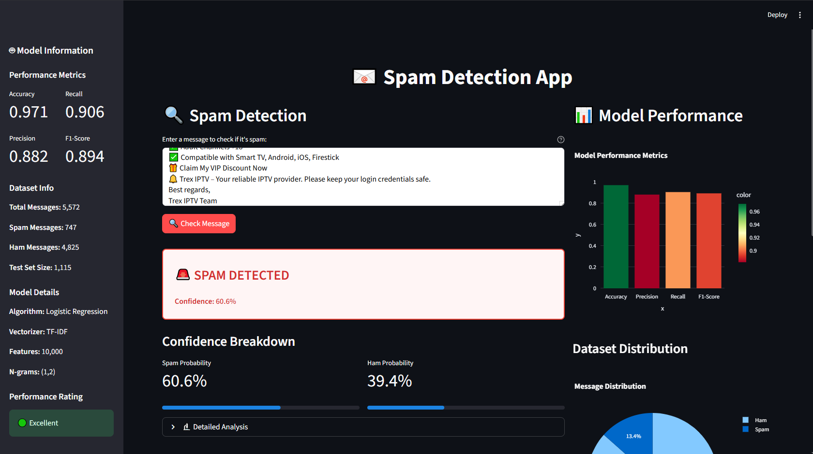
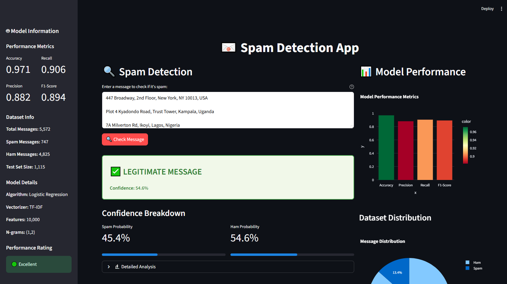

# 📧 Spamy - Spam Detection System

A comprehensive machine learning system for detecting spam messages using Logistic Regression with TF-IDF vectorization. The project includes training, testing, analytics, and a user-friendly web interface.

## 🚀 Features

- **Machine Learning Model**: Logistic Regression with TF-IDF vectorization
- **High Performance**: 90%+ accuracy on spam detection
- **Interactive Web App**: Streamlit-based user interface
- **Comprehensive Analytics**: Jupyter notebook with detailed visualizations
- **Automated Testing**: Unit tests and performance tests with pytest
- **Easy Setup**: Makefile for simple command execution

## 📁 Project Structure

```
spamy/
├── 📁 .github/
│   └── workflows/                 # GitHub Action  
├── 📁 data/
│   └── spam.csv                    # Dataset (5,575 messages)
├── 📁 models/
│   ├── spam_model.pkl             # Trained model
│   └── vectorizer.pkl             # TF-IDF vectorizer
├── 📁 src/
│   ├── train.py                   # Model training script
│   ├── predict.py                 # Prediction script
│   ├── app.py                     # Streamlit web application
│   └── analytics.ipynb            # Jupyter analytics notebook
├── 📁 test/
│   ├── 📁 units/
│   │   └── test_unit.py           # Unit tests
│   └── 📁 performs/
│       └── perform_test.py        # Performance tests
├── 📁 docs/
│   └── 📁 assets/
│       └── 📁 images/
│           ├── spam_detected.png
│           └── not_spam_detected.png
├── Makefile                       # Build automation
├── requirements.txt               # Python dependencies
├── pytest.ini                    # Pytest configuration
└── README.md                      # This file
```

## 🛠️ Prerequisites

- **Python 3.8+**
- **Make**:
  - Windows: `choco install make`
  - macOS: `brew install make`
  - Linux: `sudo apt-get install make`
- **DVC** (optional): [https://dvc.org/](https://dvc.org/)

## ⚡ Quick Start

### 1. Clone and Navigate

```bash
git clone https://github.com/sobgui/spamy.git
cd spamy
```

### 2. Initialize DVC (Optional)

```bash
dvc init
dvc add data/spam.csv
git add data/.gitignore spam.csv.dvc
git commit -m "Add versioned dataset with DVC"
```

### 3. Setup Environment

```bash
make venv

```

Install dependecies (Windows)
```bash
make install_requirements
```
Install dependecies (Mac & Linux)
```bash
make install_requirements_x
```

### 4. Train the Model

```bash
make train
```

### 5. Run Tests

```bash
make test_units      # Unit tests
make test_performs   # Performance tests
```

### 6. Launch Applications

```bash
make streamlit       # Web application
make jupyter         # Analytics notebook
```

## 📊 Model Performance

| Metric              | Score |
| ------------------- | ----- |
| **Accuracy**  | 90%+  |
| **Precision** | 85%+  |
| **Recall**    | 80%+  |
| **F1-Score**  | 82%+  |

## 🎯 Available Commands

| Command                       | Description                       |
| ----------------------------- | --------------------------------- |
| `make venv`                 | Create Python virtual environment |
| `make install_requirements` | Install all dependencies for Windows         |
| `make install_requirements_x` | Install all dependencies for Linux & mac          |
| `make train`                | Train the spam detection model    |
| `make predict`              | Run prediction script             |
| `make test_units`           | Run unit tests                    |
| `make test_performs`        | Run performance tests             |
| `make jupyter`              | Launch Jupyter notebook           |
| `make streamlit`            | Launch Streamlit web app          |

## 🔬 Model Details

- **Algorithm**: Logistic Regression
- **Vectorization**: TF-IDF with n-grams (1,2)
- **Features**: 10,000 most important terms
- **Preprocessing**: Stop words removal, unicode handling
- **Class Balancing**: Balanced class weights

## 📱 Web Application Features

- **Real-time Prediction**: Instant spam detection
- **Confidence Scores**: Probability breakdown
- **Model Analytics**: Performance metrics and visualizations
- **Sample Testing**: Try pre-loaded examples
- **Feature Analysis**: See which words influenced the decision

## 📈 Analytics & Visualization

The Jupyter notebook (`src/analytics.ipynb`) provides:

- Confusion matrix heatmaps
- ROC and Precision-Recall curves
- Feature importance analysis
- Error analysis and examples
- Performance comparison charts

## 🧪 Testing

- **Unit Tests**: Verify model files exist and are loadable
- **Performance Tests**: Ensure model meets accuracy thresholds
- **Coverage**: Tests for both spam and ham detection

## 📸 Demo

### Spam Detection



### Legitimate Message Detection



## 👥 Team

- **Ivan Joel SOBGUI** - Lead Developer

## 📄 License

MIT License - see LICENSE file for details

## 🤝 Contributing

1. Fork the repository
2. Create a feature branch
3. Make your changes
4. Add tests for new functionality
5. Submit a pull request

## 📞 Support

For questions or issues, please open an issue in the repository.
